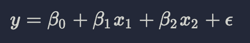
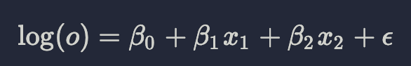
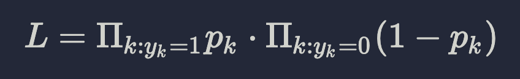

## Logistic regression

### Introduction

Linear regression can be generalized to handle dependent variables that are not numerical. If the dependent variable is boolean, the generalized model is called __logistic regression__. If the dependent variable is an integer count, it’s called __Poisson regression__.

As an example of logistic regression, suppose a friend of yours is pregnant and you want to predict whether the baby is a boy or a girl. You could use data from the NSFG to find factors that affect the “sex ratio” (the probability of having a boy).

If you encode the dependent variable numerically, for example 0 for a girl and 1 for a boy, in theory you could apply ordinary least squares, but not in practice:



The problem with this approach is that it produces predictions that are hard to interpret. The model might predict y = 0.5, but the only meaningful values of y are 0 and 1.

It is tempting to interpret a result like that as a probability (chance of having a boy). But it is also possible for this model to predict y = 1.1 or y = −0.1, and those are not valid probabilities.

Logistic regression avoids this problem by expressing predictions in terms of __odds__: “odds in favor” of an event is the ratio of the probability it will occur to the probability that it will not (e.g. 75% chance of winning is equivalent to sayind that odds in favor are three to one).

Odds and probabilities are different representations of the same information. Given a probability, you can compute the odds like this:

```python
import pandas as pd
import numpy as np
p = np.arange(start=0.0, step=0.1, stop=1.1)
o = p / (1 - p + 1e-12)
p = o / (o + 1)
```

Logistic regression is based on the following model:



Where o is the odds in favor of a particular outcome; in the example, o would be the odds of having a boy.

Suppose we have estimated the parameters β0, β1, and β2 and we are given values for x1 and x2. We can compute the predicted value of log o, and then convert to a probability:

```python
log_o = np.log(o)
o = np.exp(log_o)
p = o / (o + 1)
```

### Estimating parameters

Unlike linear regression, logistic regression does not have a closed form solution, so it is solved by guessing an initial solution and improving it iteratively.

The usual goal is to find the maximum-likelihood estimate (MLE), which is the set of parameters that maximizes the likelihood of the data.



For example, suppose we have the following data:

```python
y = np.array([0, 1, 0, 1])
x1 = np.array([0, 0, 0, 1])
x2 = np.array([0, 1, 1, 1])
```

Assume the initial guesses are:
```python
beta = np.array([-1.5, 2.8, 1.1])
```

Then for each row we can compute log_o and convert from log odds to probabilities:

```python
log_o = beta[0] + beta[1] * x1 + beta[2] * x2
print(f'{log_o=}')
o = np.exp(log_o)
p = o / (o + 1)
print(f'{p=}')
```

Notice that when log_o is greater than 0, o is greater than 1 and p is greater than 0.5.

The likelihood of an outcome is p when y==1 and 1-p when y==0. For example, if we think the probability of a boy is 0.8 and the outcome is a boy, the likelihood is 0.8; if the outcome is a girl, the likelihood is 0.2. We can compute that like this:

```python
likelihood = np.prod(y * p + (1-y) * (1-p))
print(likelihood)
```

For these values of beta, the likelihood of the data is 0.18. The goal of logistic regression is to find parameters that maximize this likelihood. We will see how to achieve that with `StatsModels`.

### Implementation

`StatsModels` provides an implementation of logistic regression called `logit`, named for the function that converts from probability to log odds. To demon- strate its use, I’ll look for variables that affect the sex ratio.

Let's start by loading and preparing our datasets:

```python
df = pd.read_csv('.lesson/assets/FemPreg.csv')
live = df.query('outcome == 1 & prglngth > 30') # filter live births
firsts = df.query('birthord == 1 & outcome == 1') # filter first borns
others = df.query('birthord != 1 & outcome == 1') # filter non-first borns
```

`logit` requires the dependent variable to be binary (rather than boolean), so we need to create a new column named boy:

```python
live = live.assign(boy = (live.babysex == 1).astype(int))
```

Factors that have been found to affect sex ratio include parents’ age, birth order, race, and social status. We can use logistic regression to see if these effects appear in the NSFG data. Let's start with the mother’s age:

```python
import statsmodels.formula.api as smf
model = smf.logit('boy ~ agepreg', data = live)
results = model.fit()
results.summary()
```

`logit` takes the same arguments as ols, a formula in Patsy syntax and a DataFrame. The result is a Logit object that contains attributes called `endog` and `exog` that contain the endogenous variable, another name for the dependent variable, and the exogenous variables, another name for the explanatory variables.

The parameter of `agepreg` is positive, which suggests that older mothers are more likely to have boys, but the p-value is 0.783, which means that the apparent effect could easily be due to chance.

The coefficient of determination, R2, does not apply to logistic regression, but there are several alternatives that are used as “pseudo R2 values.” These values can be useful for comparing models. For example, here’s a model that includes several factors believed to be associated with sex ratio:

```python
formula = 'boy ~ agepreg + hpagelb + birthord + C(race)'
model = smf.logit(formula, data=live)
results = model.fit()
results.summary()
```

Along with mother’s age, this model includes father’s age at birth (hpagelb), birth order (birthord), and race as a categorical variable. None of the estimated parameters are statistically significant. The pseudo-R2 value is a little higher, but that could be due to chance.

### Accuracy

We are most interested in the accuracy of the model: the number of successful predictions, compared with what we would expect by chance.

In our dataset there are more boys than girls, so the baseline strategy is to guess “boy” every time. The accuracy of this strategy is just the fraction of boys. Since actual is encoded in binary integers, the mean is the fraction of boys, which is 0.507.

```python
actual = model.endog
baseline = actual.mean()
print(f'{baseline=}')
```

Here’s how we compute the accuracy of the model:

```python
predict = (results.predict() >= 0.5)
true_pos = predict * actual
true_neg = (1 - predict) * (1 - actual)
acc = (sum(true_pos) + sum(true_neg)) / len(actual)
print(f'{acc=}')
```

`results.predict` returns a NumPy array of probabilities, which we round off to 0 or 1. Multiplying by actual yields 1 if we predict a boy and get it right, 0 otherwise. So, `true_pos` indicates “true positives”. Similarly, `true_neg` indicates the cases where we guess “girl” and get it right. Accuracy is the fraction of correct guesses.

The result is 0.512, slightly better than the baseline, 0.507. But the approach is not rigurous because we used the same data to build and test the model, so the model may not have predictive power on new data.

Nevertheless, let’s use the model to make a prediction for a woman that is 35 years old and white, her husband is 39, and they are expecting their third child:

```python
new = pd.DataFrame([[35, 39, 3, 2]], columns=['agepreg', 'hpagelb', 'birthord', 'race'])
y = results.predict(new)
print(f'The chances of having a boy are {y}')
```

To invoke `results.predict` for a new case, you have to construct a DataFrame with a column for each variable in the model. The result in this case is 0.52, so you should guess “boy.” But if the model improves your chances of winning, the difference is very small.
